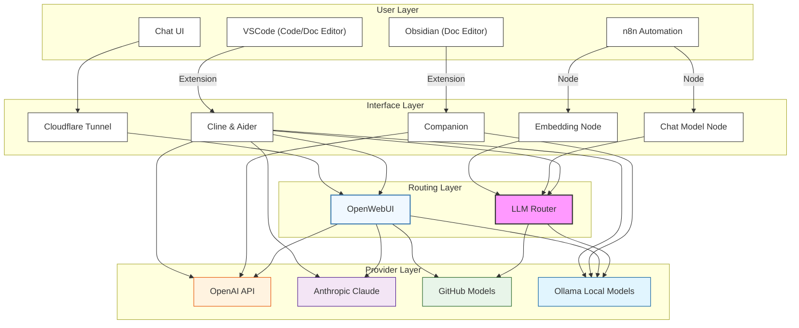

# AI Development Architecture - version 0.94

This document outlines the architecture of our AI development environment, which consists of four main layers: User Layer, Interface Layer, Routing Layer, and Provider Layer.

## Architecture Overview

### User Layer
The user layer is the interface which end-user interfacing with the system. This includes tools such as thebox.hkmci.net, VSCode, Obsidian and other n8n workflows.

#### Development Tools
- **VSCode**: Primary code editor for development
- **Obsidian**: Markdown-based documentation and note-taking

#### Web Chat UI
- **Chat UI**: User interface for chat interactions

#### Workflow Management Tools
- **n8n Automation**: Workflow automation platform

### Interface Layer
The interface layers are the extenstion, plugins and ai api call interface of the users tool to talk with the api of different AI servcices.

#### Extensions
- **Cline & Aider**: VSCode extension for AI assistance
- **Companion**: Obsidian extension for AI integration

#### n8n Nodes
- **Embedding Node**: Handles text embeddings
- **Chat Model Node**: Manages chat interactions

#### Connections
- **Cloudflare Tunnel**: Secure connection for web interfaces

### Routing Layer
The routing layer handles the api call from the interface layer to the different AI service providers. As a result, we can make sure all tools can talk to different provider by the api call translation from the api call routers. It also reduce the burden of decentrailized api keys management.

- **LLM Router**: Central routing system (litellm) managing model traffic and distribution. At this point, LiteLLM only handle Azure Github model translation so that we can enjoy the free openai api calls through this routing services.
- **OpenWebUI**: Other than the Web Chat interface. OpenWebUI support individual API key management for end users. So that the end-users can call all the available ai api of the company from this united api service. Please note that it's not a openai compatible api.

### Provider Layer
- **OpenAI**: OpenAI, provide gpt4o and other gpt models.
- **Anthropic Claude**: Claude, provide Sonet and Haiku models.
- **GitHub Models**: Azure Service from Github. Provide Free openai gpt4o services.
- **Ollama Local Models**: Self-hosted model deployment. Provide Llama 3.1, 3.2, Qwen, Qwen-coder, Mistral etc...

## Connection Flow
1. User tools connect through the interface layer to the routing layer
2. The routing layer provides api service to the providers available
3. Provider layer offers both commercial and self-hosted options

## Architecture Diagram
<!-- Local Development Version -->

## Key Benefits
1. **Flexibility**: Multiple AI providers and tools
2. **Integration**: Seamless connection between development tools
3. **Scalability**: Support for both local and cloud-based models
4. **Control**: Central routing for traffic management
5. **Extensibility**: Easy to add new tools and providers
