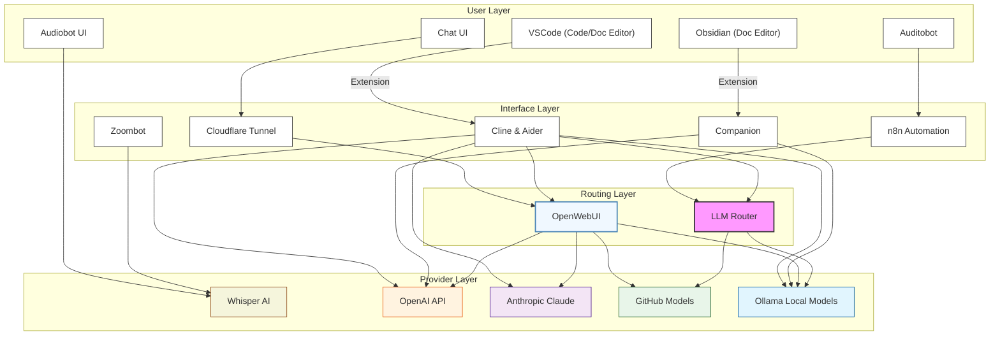

# AI Development Architecture - version 0.95

This document outlines the architecture of our AI development environment, which consists of four main layers: User Layer, Interface Layer, Routing Layer, and Provider Layer.

## Architecture Overview

### User Layer
The user layer is the interface which end-user interfacing with the system. This includes tools such as thebox.hkmci.net, VSCode, Obsidian, n8n workflows, and Audiobot UI.

#### Development Tools
- **VSCode**: Primary code editor for development
- **Obsidian**: Markdown-based documentation and note-taking

#### Web Chat UI
- **Chat UI**: User interface for chat interactions
- **Audiobot UI**: User interface for audio interactions

#### Workflow Management Tools
- **n8n Automation**: Workflow automation platform

### Interface Layer
The interface layers are the extensions, plugins, and AI API call interfaces of the users' tools to communicate with different AI services.

#### Extensions
- **Cline & Aider**: VSCode extension for AI assistance
- **Companion**: Obsidian extension for AI integration

#### n8n Nodes
- **Embedding Node**: Handles text embeddings
- **Chat Model Node**: Manages chat interactions

#### Connections
- **Cloudflare Tunnel**: Secure connection for web interfaces
- **Zoombot**: Interface for Zoom interactions

### Routing Layer
The routing layer handles the API calls from the interface layer to the different AI service providers. It ensures all tools can communicate with different providers by translating API calls and managing decentralized API keys.

- **LLM Router**: Central routing system (litellm) managing model traffic and distribution. Currently handles Azure GitHub model translation for free OpenAI API calls.
- **OpenWebUI**: Supports individual API key management for end-users, allowing access to all company AI APIs.

### Provider Layer
- **OpenAI**: Provides GPT models
- **Anthropic Claude**: Provides Sonet and Haiku models
- **GitHub Models**: Azure service providing free OpenAI GPT4o services
- **Ollama Local Models**: Self-hosted models like Llama, Qwen, and Mistral
- **Whisper AI**: Provides audio processing capabilities

## Connection Flow
1. User tools connect through the interface layer to the routing layer
2. The routing layer provides API services to the available providers
3. Provider layer offers both commercial and self-hosted options

## Architecture Diagram
<!-- Local Development Version -->

## Key Benefits
1. **Flexibility**: Multiple AI providers and tools
2. **Integration**: Seamless connection between development tools
3. **Scalability**: Support for both local and cloud-based models
4. **Control**: Central routing for traffic management
5. **Extensibility**: Easy to add new tools and providers
