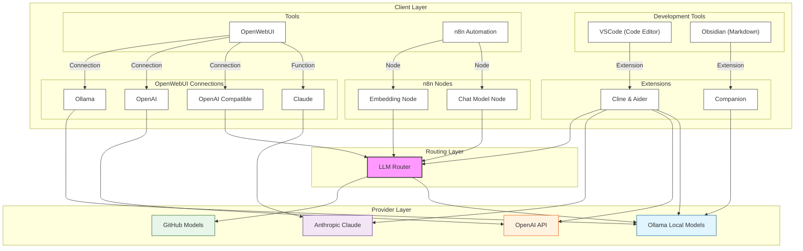

# AI Development Architecture - version 0.93

This document outlines the architecture of our AI development environment, which consists of three main layers: Client Layer, Routing Layer, and Provider Layer.

## Architecture Overview

### Client Layer
The client layer consists of several key components:

#### Development Tools
- **VSCode**: Primary code editor for development
- **Obsidian**: Markdown-based documentation and note-taking

#### Tools
- **OpenWebUI**: Web interface for AI interactions
- **n8n Automation**: Workflow automation platform

#### Extensions
- **Cline & Aider**: VSCode extension for AI assistance
- **Companion**: Obsidian extension for AI integration

#### n8n Nodes
- **Embedding Node**: Handles text embeddings
- **Chat Model Node**: Manages chat interactions

#### OpenWebUI Connections
- **Ollama**: Local model integration
- **OpenAI**: Direct OpenAI API access
- **OpenAI Compatible**: Compatible API endpoints
- **Claude**: Anthropic's Claude integration

### Routing Layer
- **LLM Router**: Central routing system (litellm) managing model traffic and distribution

### Provider Layer
- **OpenAI API**: Primary commercial API provider
- **Anthropic Claude**: Alternative commercial provider
- **GitHub Models**: Open-source model repository
- **Ollama Local Models**: Self-hosted model deployment

## Connection Flow
1. Client tools connect either directly to providers or through the routing layer
2. The routing layer (litellm) manages traffic distribution to appropriate providers
3. Provider layer offers both commercial and self-hosted options

## Architecture Diagram
<!-- Local Development Version -->

## Key Benefits
1. **Flexibility**: Multiple AI providers and tools
2. **Integration**: Seamless connection between development tools
3. **Scalability**: Support for both local and cloud-based models
4. **Control**: Central routing for traffic management
5. **Extensibility**: Easy to add new tools and providers
